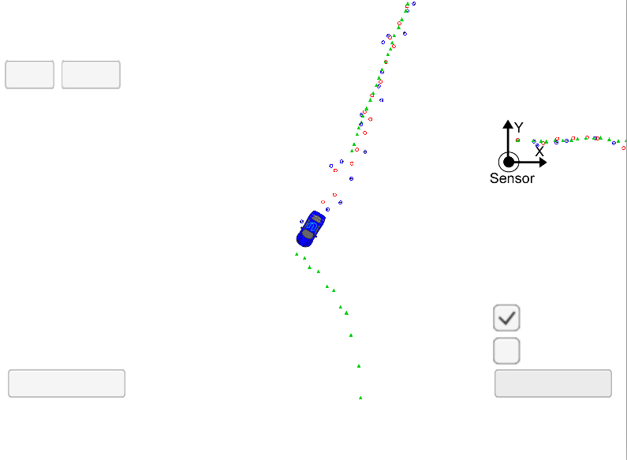
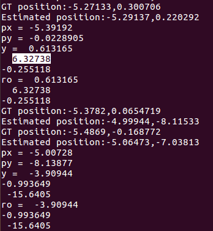
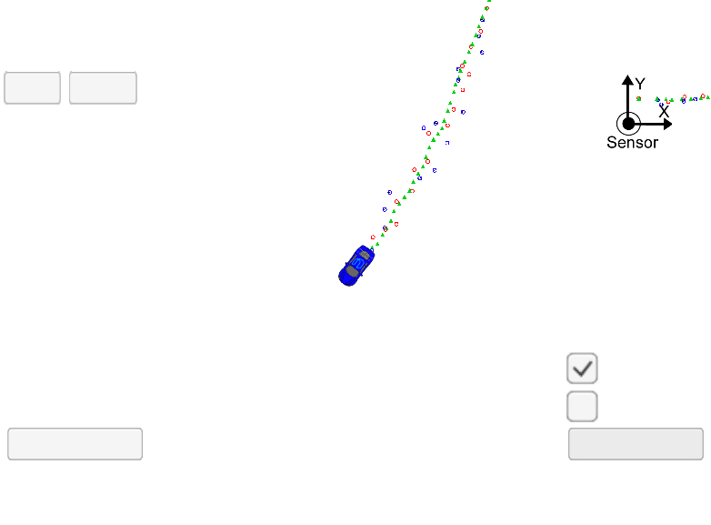

# Extended Kalman Filter Project

This project was developed as part of the Udacity Self-Driving Car Engineer Nanodegree Program. The goal was to develop an Extended Kalman Filter to combine Radar and Lidar measurements and predict a car position with a Root-mean-square Error values under 0.11, 0.11, 0.52 and 0.52 for x, y, vx and vy, respectively.

## Overview

Kalman filters are algorithms that use noisy measurements to estimate the state of a moving object of interest by constantly predicting and updating it every time a new measurement is received. In this project two types of sensors were used (Lidar and Radar) to estimate a car position over time. Since the Radar measurement function is nonlinear, an Extended Kalman Filter had to be implemented to linearize the function and then use the linear approximation in regular Kalman filter equations.

## Environment Setup

Instructions for setting up the environment can be found [here](setup.md). After compiling, run the executable and open the simulator on the EKF & UKF project to check it out.

## Implementation

After I understood how the starter code was laid out and how the files connected to the other, I dived in to coding the filters in the `kalman_filter.cpp` and then combining them in the `FusionEKF.cpp`. If a radar measurement was received, an extended Kalman filter update was used. For that, it was necessary to calculate the jacobian and linearize the measurement function.

Since I used a lot of code from the quizzes, I ran into a few bugs at first which were quickly solved by just making sure the variables were consistent and that the state mean and covariance matrix were being updated by the end of each step of the process.

To initialize the mean state vector I peaked at the data set and copied the first values for `px` and `py`. The state covariance matrix and the transition matrix were initialized as identity matrices. The `noise_ax` and `noise_ay` were both set to `9`.

Everything compiling and running alright, I was having this problem:



This was causing the RMSE values to raise quite a lot. Since it happened when the `py` values approached zero, I imagined that this could be a problem of angle normalization or division by zero so I decided to print some values and stop the simulation right at the point where the problem was happening. I then noticed that the `theta` value of the `y` vector used to update the state was `6.32728` right before the estimated `py` jumped from `0.220292` to `-8.11533` as shown in the picture:



This meant I had to normalize this `theta` before actually updating the state as the simulator expects values between `pi` and `-pi`. By adding the following piece of code I managed to meet the RMSE values required to pass the project.

```
while (y(1)> M_PI) y(1)-=2.*M_PI;
while (y(1)<-M_PI) y(1)+=2.*M_PI;
```

Here a picture of the final program at the same point were the bug was happening before.



### Final RMSE values

After that fix, I was able to finish the simulation with the following values of RMSE:

```
RMSE X: 0.0944926
RMSE Y: 0.0845576
RMSE Vx: 0.303168
RMSE Vy: 0.396266
```


### Author

Diogo Loreto Leal, Self-Driving Car Engineer Nanodegree Student
